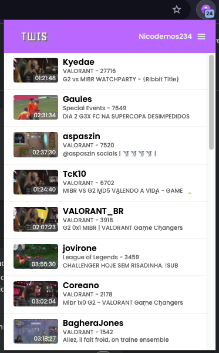

<h1 align="center">TWIS - Twitch Who is Streaming</h1>

Twis is a chrome extension to help twitch users to see when they streamers are online.

<a href="https://bit.ly/twis-extension">Download here</a>

Screenshot:

  
  

